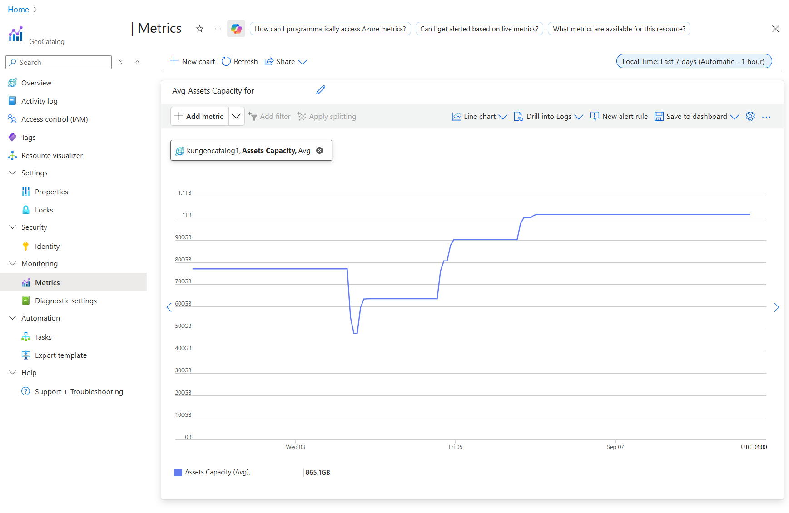

# Microsoft Planetary Computer Pro service usage meters

Microsoft Planetary Computer Pro offers a pay-as-you-go usage model. You're charged for the resources you consume, providing flexibility and control over your spending. This article details the usage meters for the different components of the service.

## Access usage metrics through the Azure portal

Detailed information about the utilization of your GeoCatalog resource is available in the Azure portal under **Monitoring**>**Metrics** in the resource view. 

## Service usage meters

Usage of the service is measured with the following dimensions:

| Meter                       | Measured Units            | Description                                                                                                |
|----------------------------|---------------------------|------------------------------------------------------------------------------------------------------------|
| **Geospatial Storage**               | GiB-month                  | Ingested data stored after any cloud-optimization and compression.                                         |
| **Geospatial Data Operations**             | 10K operations            | Storage read / metadata retrieval operations (search, list, item/asset metadata access).                   |
| **Ingestion & Transformation** | vCPU-hour                 | Compute consumed transforming data into cloud-optimized formats (for example COG generation) and ingesting data into GeoCatalog.              |
| **Bandwidth**              | GiB                 | Data transferred out of the Azure region hosting the GeoCatalog resource.                                  |

All meters are calculated using binary gigabytes (GiB), where 1 GiB equals 1,073,741,824 bytes. 

### Geospatial Storage

Measured in GiB-month of data stored in your GeoCatalog (original plus derived / optimized forms). Includes any cloud-optimized representations generated by the platform.

### Geospatial Data Operations

Operations are read operations for data that is stored in the managed storage inside a GeoCatalog resource. Common patterns include:
* Use the SAS API to read stored assets.
* Use the Data API to render a tiles based on managed data.,

Use of the [STAC API](./stac-overview.md) for querying or searching a catalog isn't considered a read operation. 

### Ingestion & Transformation

Measured in vCPU-hours consumed while ingesting and transforming source data (including optimization to formats such as COGs). Consumption varies with data volume and the format of the data. 

To estimate your vCPU-hours, choose a data type similar to the one you plan to ingest:
 
| Data Type | Format State | Description (Format / Bands) | Representative vCPU-hours/GiB |
|-----------|--------------|------------------------------|--------------------------|
| [Sentinel‑2 L2A](./data-visualization-samples.md#sentinel-2-l2a-collection-configuration) | Non-COG | GeoTIFF; 13 MSI spectral bands (B1–B12 incl. B8A, 10–60 m) plus QA masks | 0.50 |
| Micro COG 1000 | COG | Cloud Optimized GeoTIFFs (1000 2-10 MB files); Three bands (RGB) | 0.423 |
| Aerial Orthomosaic | Non-COG | Orthorectified GeoTIFF mosaic; Three bands (RGB); large tiles | 0.20 |
| [National Aerial Imagery Program](./data-visualization-samples.md#the-national-agriculture-imagery-program-collection-configuration) | COG | Cloud Optimized GeoTIFF; Four bands (RGB + NIR) | 0.030 |

To estimate your vCPU-hours, select a data type that's similar to the one you plan on ingesting, and multiply the **Representative vCPU-hours/GiB**  value by the number of gigabytes of data you intend to ingest. 

> [!EXAMPLE]
>Suppose you're ingesting 250 GiB of [National Aerial Imagery Program](./data-visualization-samples.md#the-national-agriculture-imagery-program-collection-configuration) (NAIP) data already in Cloud Optimized GeoTIFF (COG) format. Using the representative value of 0.030 vCPU/GiB from the table:
> $250 \text{ GiB} \times 0.030 \frac{\text{vCPU-hour}}{\text{GiB}} = 7.5 \text{ vCPU-hours}$

### Bandwidth

Measured in GiB egress when data leaves the Azure region of the GeoCatalog resource. Egress occurs concurrently with read [operations](#operations) when data leaves a GeoCatalog resource and goes to a different Azure Region or to the internet. 

## Cost management

Azure provides tools to help you monitor and manage your spending. You can use [Microsoft Cost Management and Billing](/azure/cost-management-billing/cost-management-billing-overview) to track your Microsoft Planetary Computer Pro usage and costs, set budgets, and receive alerts.

## Next steps

- [Microsoft Planetary Computer Pro Overview](./microsoft-planetary-computer-pro-overview.md)
- [Get started with Microsoft Planetary Computer Pro](./get-started-planetary-computer.md)
